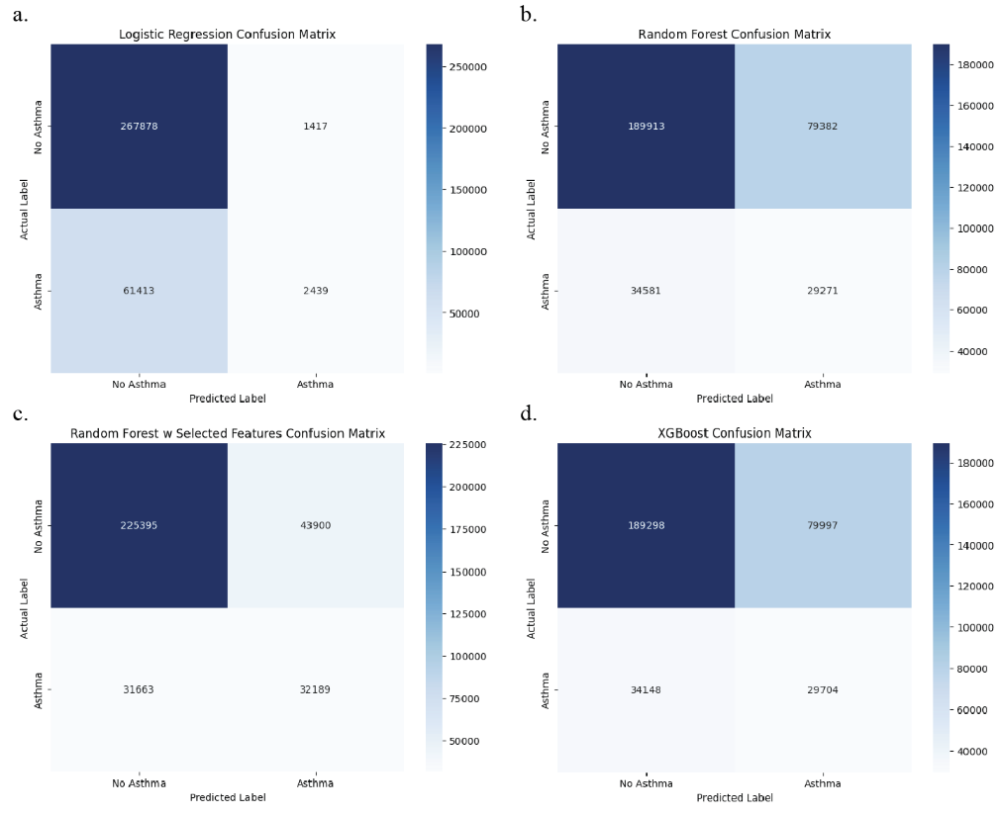
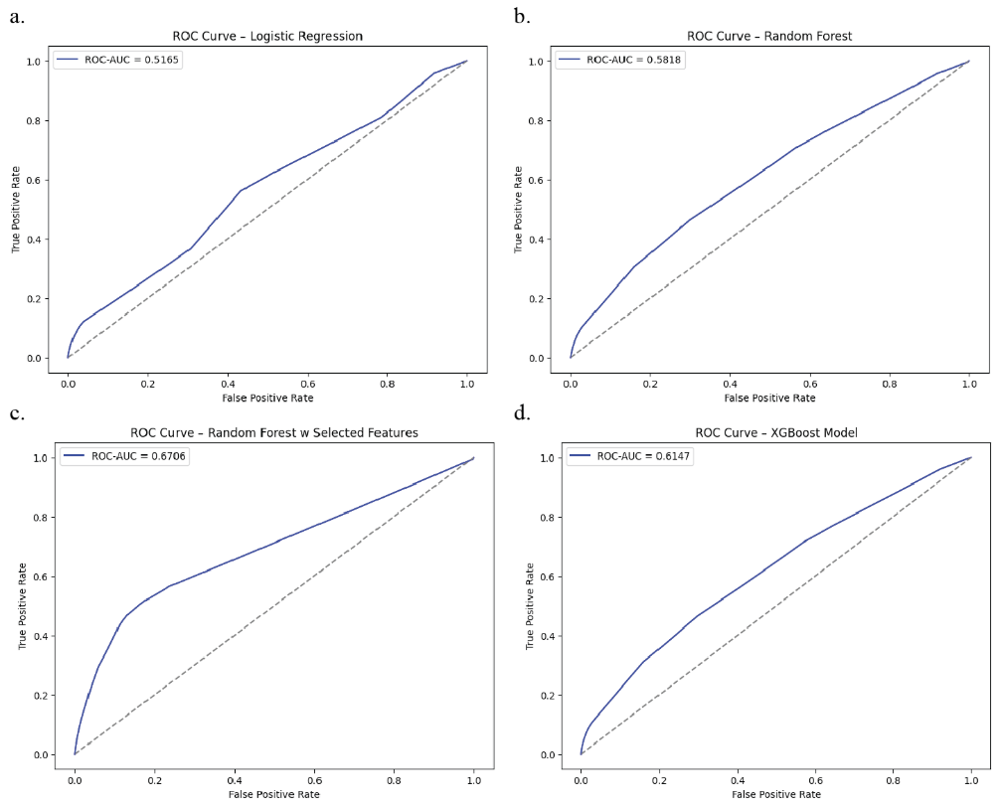
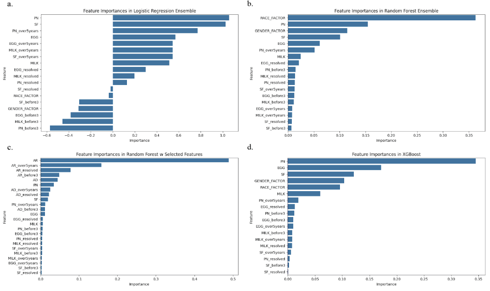
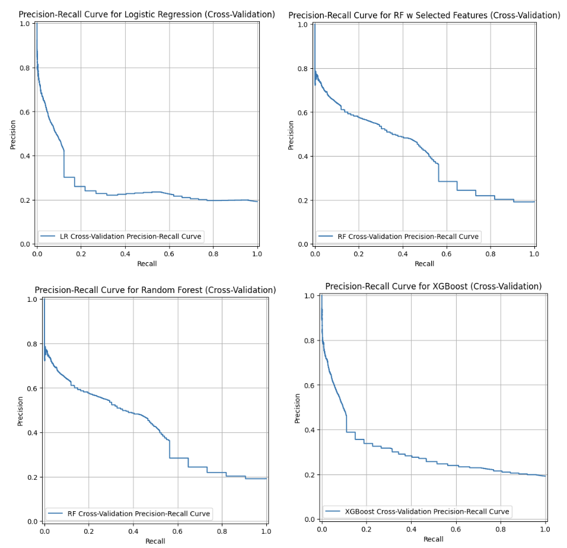
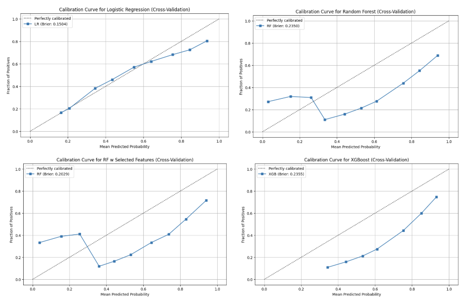
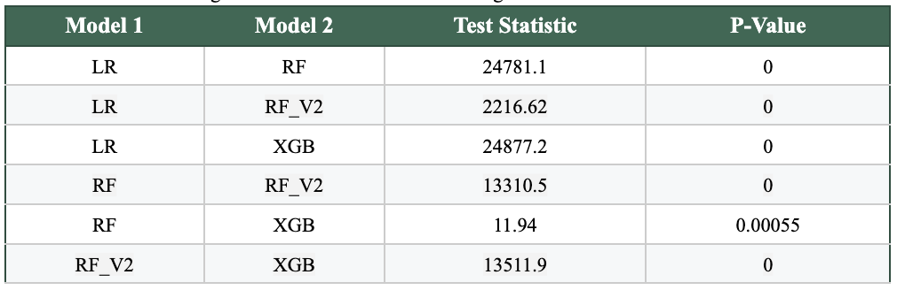

# Prediction of Patient Asthma Development Using Food Allergies and Atopic Manifestations

**Jihye Lee¹, Cristian Miko Yadao Santos¹, Breno Madi De Biasi¹**  
¹Department of Bioengineering, University of California, Los Angeles

## Overview

Asthma is a chronic inflammatory airway disease that often develops in children with prior allergic conditions. This progression is commonly referred to as the **atopic march**, in which early allergic manifestations such as **food allergies and atopic dermatitis** precede the development of **allergic rhinitis and asthma**.

Early identification of children at risk for asthma could improve clinical monitoring and enable preventative interventions. In this project, we evaluate whether **machine learning models can predict asthma development using demographic and allergy-related clinical features** derived from a large pediatric electronic medical record (EMR) dataset.

We trained and compared multiple machine learning models to identify patterns linking early allergic disease with later asthma development.

## Key Results

Using a dataset of **~333,000 pediatric patients**, we evaluated several models using **5-fold cross-validation**.

| Model | Accuracy | Precision | Recall | F1 Score | ROC-AUC |
|------|------|------|------|------|------|
| Logistic Regression | **0.811** | **0.633** | 0.038 | 0.072 | 0.516 |
| Random Forest | 0.658 | 0.269 | 0.458 | 0.339 | 0.582 |
| Random Forest (Expanded Features) | 0.773 | 0.423 | **0.504** | **0.460** | **0.671** |
| XGBoost | 0.657 | 0.271 | 0.465 | 0.342 | 0.584 |

**Main findings**

- Logistic Regression achieved the **highest accuracy and precision**, favoring correct identification of non-asthma cases.
- Random Forest with expanded allergy features achieved the **best recall, F1-score, and ROC-AUC**, indicating better detection of true asthma cases.
- Including **atopic dermatitis and allergic rhinitis features significantly improved predictive performance.**

These findings suggest that **patterns of allergic disease progression can provide predictive insight into asthma development.**

---

# Dataset

The dataset originates from a pediatric EMR study analyzing the epidemiology of allergic diseases in children.

Data Source:  
https://zenodo.org/records/44529#.Y7FI3NJBwUE

The dataset contains approximately **333,200 pediatric patients** with demographic and clinical data including:

- Birth year
- Gender
- Race
- Ethnicity
- Insurance payer
- Age at start and end of study
- Allergy diagnoses
- Asthma diagnosis

**Dataset 1** includes gender, race, and four major food allergens (shellrish, milk, egg, peanut).

**Dataset 2** excludes gender and race, includes atopic dermatitis, allergic rhinitis, and four major food allergens (shellrish, milk, egg, peanut).

---

# Features

From the clinical records, we engineered **39 predictive features** describing allergy presence, onset, persistence, and resolution.

## Allergic Conditions Used

Primary food allergens:

- Shellfish
- Milk
- Egg
- Peanut

Additional atopic conditions:

- Atopic Dermatitis
- Allergic Rhinitis

## Feature Types

For each allergy condition:

- `ALG` – Presence of allergy
- `ALG_before3` – Allergy onset before age 3
- `ALG_resolved` – Allergy resolved
- `ALG_resolvedby3` – Allergy resolved before age 3
- `ALG_over5years` – Persistent allergy (>5 years)
- `ASM_after_ALG` – Asthma diagnosed after allergy onset

### Target Variable

- `ASM` - Presence of Asthma

---

# Machine Learning Models

We evaluated four supervised learning models.

## Logistic Regression (LR)

- Maximum iterations: 1000
- Applied to Dataset 1

## Random Forest (RF)

- 200 decision trees
- Applied to Dataset 1

## Random Forest V2 (RF_V2)

- Applied to Dataset 2
- Excludes demographic variables
- Includes expanded atopic disease features

## XGBoost (XGB)

- 200 estimators
- Maximum tree depth: 3
- Learning rate: 0.05
- Applied to Dataset 1

---

# Evaluation Metrics

Models were evaluated using **5-fold cross-validation** with the following metrics:

- Accuracy
- Precision
- Recall
- F1-score
- ROC-AUC

In medical prediction tasks, **recall is particularly important** because missing a patient who will develop asthma (false negative) is clinically costly.

---

# Statistical Testing

To evaluate differences between model predictions, we performed the **McNemar Test** on all model pairs.

Key finding:

- All model comparisons showed **statistically significant differences (p < 0.05)**.
- Tree-based models identified patterns not captured by logistic regression.

---

# Results
**Figure 1.** Confusion matrices. [A] LR. [B] RF. [C] RF_V2. [D] XGB.

**Figure 2.** Receiver Operating Characteristic Curve. [A] LR. [B] RF. [C] RF_V2. [D] XGB.

**Figure 3.** Feature Importance. [A] LR. [B] RF. [C] RF_V2. [D] XGB.

**Figure 4.** Precision Recall Curves. [[A] LR. [B] RF. [C] RF_V2. [D] XGB.

**Figure 5.** Calibration Curves. [A] LR. [B] RF. [C] RF_V2. [D] XGB.

**Table 1.** McNemar Testing for Each Pair of Machine Learning Models. 

---

# Code Availability

[allergy_prediction_code.ipynb](https://github.com/jlee92603/asthma_allergy_prediction/blob/main/allergy_prediction_code.ipynb)

---

# References

Alduraywish, Shatha A., et al. “Is There a March from Early Food Sensitization to Later Childhood Allergic Airway Disease? Results from Two Prospective Birth Cohort Studies.” Pediatric Allergy and Immunology: Official Publication of the European Society of Pediatric Allergy and Immunology, vol. 28, no. 1, Feb. 2017, pp. 30–37. PubMed, https://doi.org/10.1111/pai.12651.

Chabra, Rina, and Mohit Gupta. “Allergic and Environmentally Induced Asthma.” StatPearls, StatPearls Publishing, 2026. PubMed, http://www.ncbi.nlm.nih.gov/books/NBK526018/.

Foong, Ru-Xin, et al. “Asthma, Food Allergy, and How They Relate to Each Other.” Frontiers in Pediatrics, vol. 5, May 2017. Frontiers, https://doi.org/10.3389/fped.2017.00089.

Hill, David A., et al. “The Epidemiologic Characteristics of Healthcare Provider-Diagnosed Eczema, Asthma, Allergic Rhinitis, and Food Allergy in Children: A Retrospective Cohort Study.” BMC Pediatrics, vol. 16, Aug. 2016, p. 133. PubMed, https://doi.org/10.1186/s12887-016-0673-z.

Illi, Sabina, et al. “The Natural Course of Atopic Dermatitis from Birth to Age 7 Years and the Association with Asthma.” The Journal of Allergy and Clinical Immunology, vol. 113, no. 5, May 2004, pp. 925–31. PubMed, https://doi.org/10.1016/j.jaci.2004.01.778.

Jacques, Camille, and Ilaria Floris. “How an Immune-Factor-Based Formulation of Micro-Immunotherapy Could Interfere with the Physiological Processes Involved in the Atopic March.” International Journal of Molecular Sciences, vol. 24, no. 2, Jan. 2023, p. 1483. PubMed, https://doi.org/10.3390/ijms24021483.

Spergel, Jonathan M. “From Atopic Dermatitis to Asthma: The Atopic March.” Annals of Allergy, Asthma & Immunology: Official Publication of the American College of Allergy, Asthma, & Immunology, vol. 105, no. 2, Aug. 2010, pp. 99–106; quiz 107–09, 117. PubMed, https://doi.org/10.1016/j.anai.2009.10.002.

Stern, Jessica, et al. “Asthma Epidemiology and Risk Factors.” Seminars in Immunopathology, vol. 42, no. 1, Feb. 2020, pp. 5–15. Springer Link, https://doi.org/10.1007/s00281-020-00785-1.

Vermeulen, Evelien M., et al. “Food Allergy Is an Important Risk Factor for Childhood Asthma, Irrespective of Whether It Resolves.” The Journal of Allergy and Clinical Immunology. In Practice, vol. 6, no. 4, 2018, pp. 1336-1341.e3. PubMed, https://doi.org/10.1016/j.jaip.2017.10.019.
